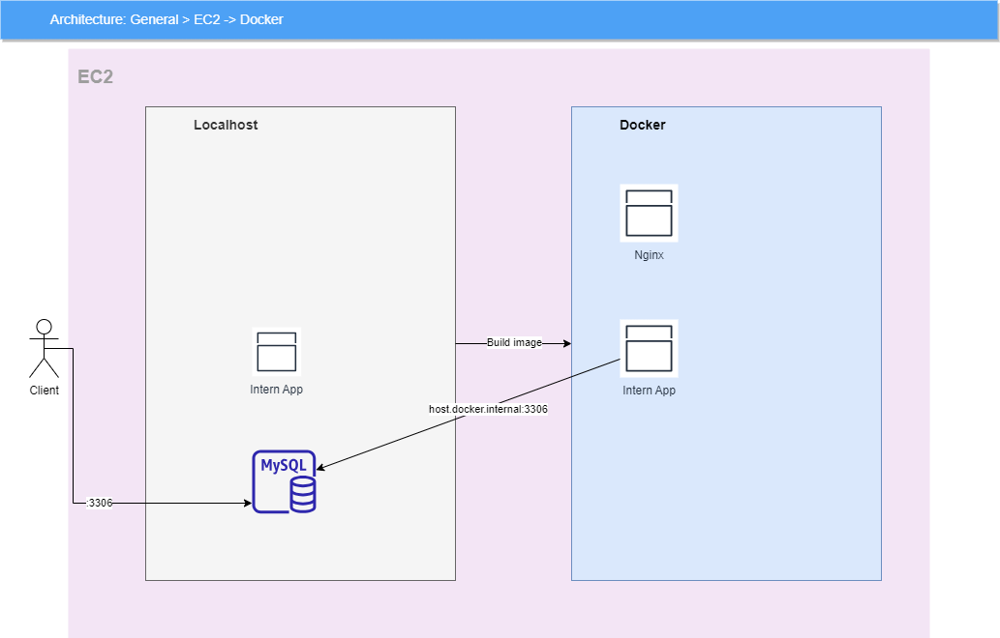

# Version 1.0 Cloud Mode
- Owner: BWV-vinh-tt
- Manage resources via Terraform Cloud. No need to use personal AWS access/secret key
- Use cases:
  + Many mentors control AWS services
  + Avoid conflict if have many changes request

# Init AWS services as code
- EC2 - SG - EIP
- SSM - Manage EC2 state (Start at 00:00 UTC / Stop at 12:00 PM UTC)
- Terraform control AWS resources
- Using Terraform CLOUD to manage resources state -> No need AWS access/secret key

# Script process
- Install environment node/php/git
- Install mysql on Linux
- Clone source & deploy via docker-compose up

# Usage Init Infrastructure
- Install https://developer.hashicorp.com/terraform/downloads?product_intent=terraform on your remote machine (mentor machine)
- Create key pairs SSH for each regions from AWS
- Download this repo
- Create one file terraform.tfvars (example below)
- Define all instances in modules.tf (example below)
- Define output format (optional)
- Run command:
  ```
    terraform login -> yes -> Ignore tab browser -> Paste this key: [...]
    terraform init
    terraform plan -> Optional but important this command help check validation
    terraform apply --auto-approve
  ```
- Output result:
  ```javascript
    info-server-1 = {
      "EC2_ID" = "i-07c39f377ab1799a9"
      "EC2_IP" = "54.64.40.69"
      "EC2_NAME" = "intern-exam-01"
      "MYSQL_DATABASE_SHEMA" = "db_intern"
      "MYSQL_PASSWORD" = "Bwv@2023"
      "MYSQL_USER_NAME" = "admin"
      "REGION" = "ap-northeast-1c"
    }
  ```
# Remove Intrastructure
- Destroy all services by command:
  ```
    terraform destroy
    Confirm: 'Yes'
  ```

# terraform.tfvars example

| Variables    | Description | Required | Example|
| -------- | ------- |  ------- | ------- |
| default_aws_region  | AWS region for your resources    |  •| ap-northeast-1|
| key_pair_name  | key pair SSH created from AWS    |  •| vinh-tt-personal|

#  modules.tf example
```javascript
    module "intern-server" {
      source = "./intern-server"
      // aws."key" = aws."region" [ap-northeast-1, us-east-1, ap-southeast-1] 
      providers = {
        aws = aws.ap-northeast-1
      }
      // CONST VARS
      ec2_instance_type = var.ec2_instance_type
      cidr_blocks       = var.cidr_blocks
      cron_start        = var.cron_start
      cron_stop         = var.cron_stop

      // DYNAMIC VARS
      ami_id            = "ami-04beabd6a4fb6ab6f" // Linux 2023, Ref AWS website
      key_pair_name     = "vinh-tt-personal"
      tag_name_instance = "intern-exam-001"
      mysql_user_name   = "admin"
      mysql_password    = "Bwv@2023"
      mysql_db_schema   = "db_intern"
      git_url           = "github.com/###/###.git"
      github_token      = "ghp_#################################"
    }
```
# Explain variables
| Variables    | Description | Required | Example
| -------- | ------- |  ------- | ------- |
| aws_region  | AWS region for your resources    |  •| ap-northeast-1|
| key_pair_name    |  Key SSH   |  • |vinh-tt-personal|
| tag_name_instance    |  Tag name for instances   |  • |intern-vinh-tt|
| mysql_user_name    |  MySQL username for database access   |  • |admin|
| mysql_password    |  MySQL password for database access   |  • |Bwv@2023|
| mysql_db_schema    |  Database schema   |  • |db_intern|
| github_token    |  Your GitHub personal access token   |  • |-|
| git_url    |  URL to your Git repository   |  • |github.com/abc...|
| cron_start    |  cron regex starting time ec2   |  |0 0 0 ? * MON-FRI *|
| cron_stop    |  cron regex stopping time ec2   |   |0 12 ? * MON-FRI *|
| cidr_blocks    |  Limit access IP list(string)   |   |["118.69.72.236/32"]|
| ec2_instance_type    |  Ec2 type   |   |t2.micro|
| ami_id    |  Amazon machine image   |   |ami-04beabd6a4fb6ab6f|

# Note
- Should rotate key-pair after one Internship season
- Use only one key-pair for all instances is recommended
- Terraform key, please contact me

# List AMI
| Region    | Description | AMI id | Resources
| -------- | ------- |  ------- | ------- |
| ap-northeast-1  | Linux 2023    |  ami-04beabd6a4fb6ab6f| Empty
| us-east-1  | Linux 2023    |  ami-08a52ddb321b32a8c| Empty
| ap-southeast-1  | Linux 2023   |  ami-091a58610910a87a9 | Empty

# Source code intern design



# Demo

https://drive.google.com/file/d/11GSkVc3J5VqL2-MTNzQZ2BamBW09Q0_V/view?usp=drive_link

# Dependencies
- Terraform v1.5.4
- AWS Provider ~v3.27
- Nodejs intern source: https://github.com/BWV-Dev/intern-nodejs-source